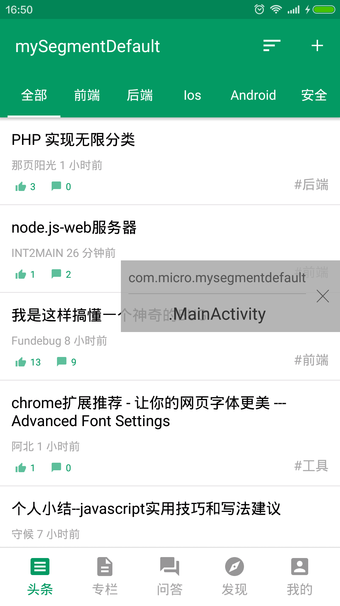
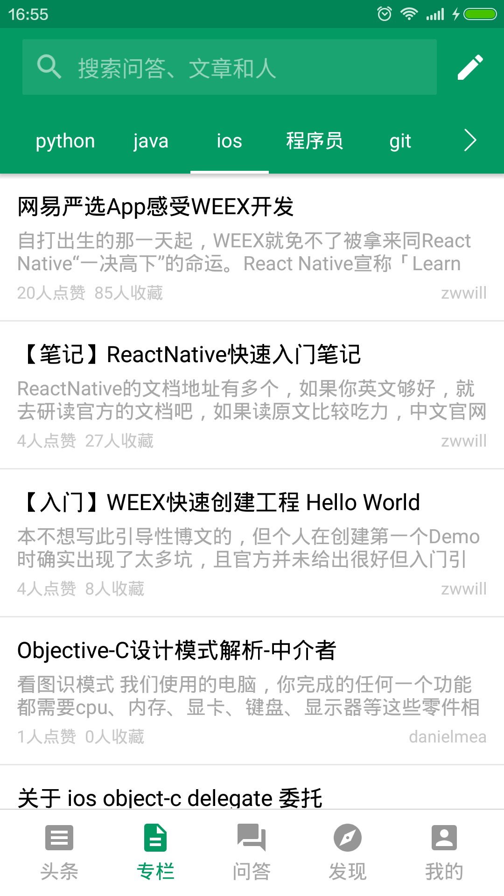
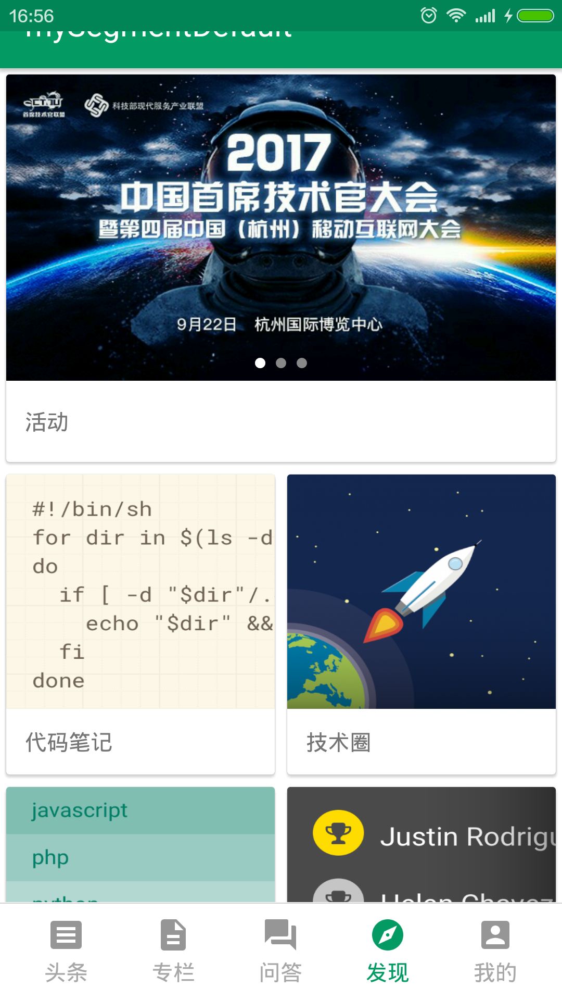
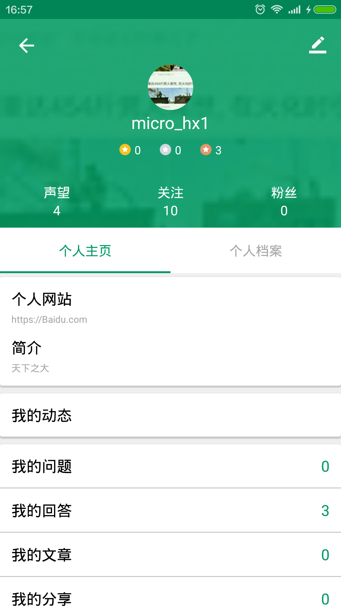
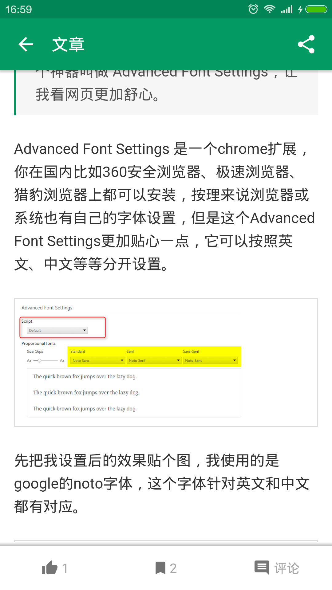

### 项目介绍
  高仿项目来源于<a href='https://segmentfault.com/'>segmentfault app</a> 
  使用接口获取数据，使用<a href='http://www.cnblogs.com/lonelywolfmoutain/p/4233438.html'>jangod-template</a>注入到webview页面中,
  然后展示相应的数据。

### 项目截图

### 开源框架
  <a href='https://github.com/square/okhttp'>OkHttp3</a> 
  <a href='https://github.com/square/retrofit'>Retrofit</a> 
  <a href='https://github.com/ReactiveX/RxJava'>RxJava</a> 
  <a href='https://github.com/ReactiveX/RxAndroid'>RxAndroid</a> 
  <a href='https://github.com/bumptech/glide'>Glide</a> 
  <a href='https://github.com/greenrobot/EventBus'>EventBus</a> 
  <a href='https://github.com/JakeWharton/butterknife'>butterknife</a> 

  使用MVP架构

### issue
   QQ:294097370 
   email:<a href="mailto:javainstalling@163.com">javainstalling@163.com</a>

### version
   1.0
     完成了页面逻辑，用户登录，用户信息修改，评价，收藏等基本常用功能.

### TODO
    1.富文本编辑提交答案，写文章 
    2.文章内js逻辑
    3.使用React Native重构活动页面
    4.缓存设置
    5.用户socket聊天机制
    6.代码重构
    ...

### License

      Copyright 2017 microhx

      Licensed under the Apache License, Version 2.0 (the "License");
      you may not use this file except in compliance with the License.
      You may obtain a copy of the License at

          http://www.apache.org/licenses/LICENSE-2.0

      Unless required by applicable law or agreed to in writing, software
      distributed under the License is distributed on an "AS IS" BASIS,
      WITHOUT WARRANTIES OR CONDITIONS OF ANY KIND, either express or implied.
      See the License for the specific language governing permissions and
      limitations under the License.
